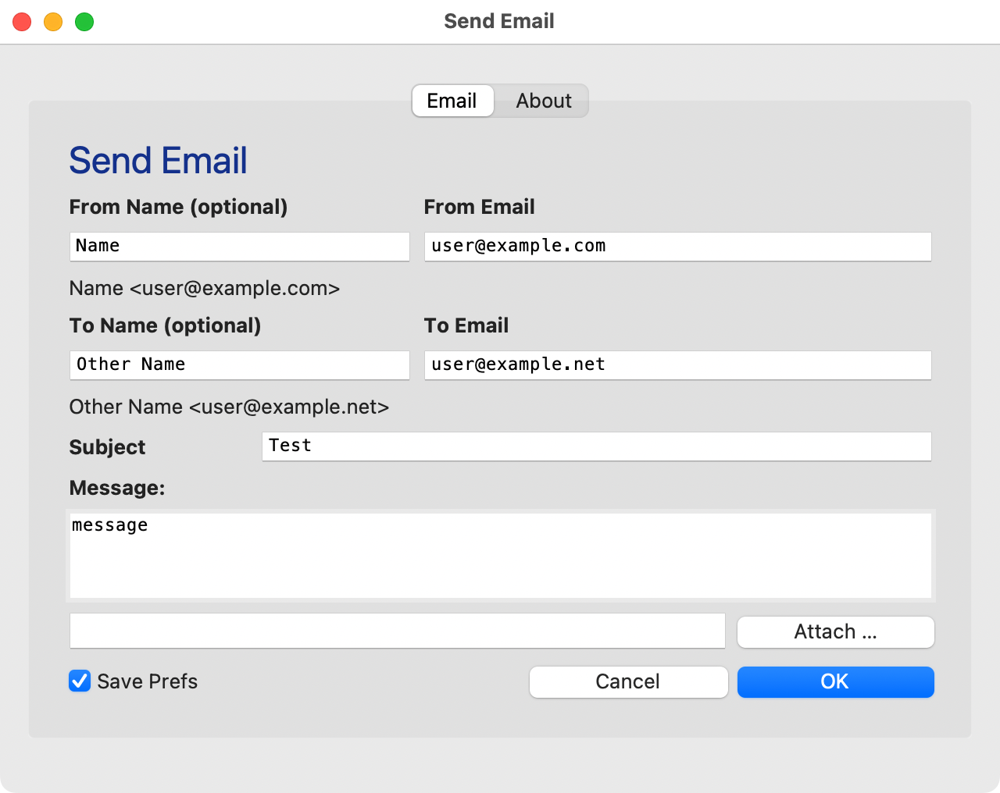
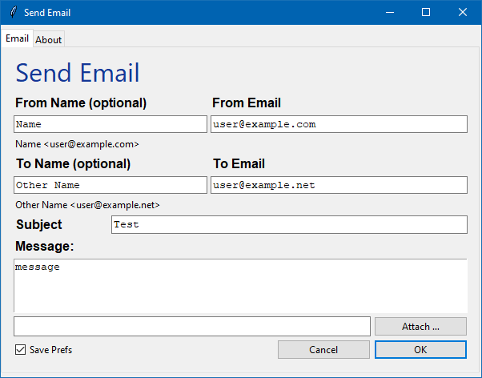

#   MicroMailer

MicroMailer is a simple mail sending application. It doesn’t require a separate MTA (Main Transfer Agent or Mail Server).

It looks something like this:

| Macintosh                                             | Windows                                               |
|-------------------------------------------------------|-------------------------------------------------------|
|  |  |

##	Usage

Form items in _bold__ are required:

| Form Item        | Description                                                                            |
|------------------|----------------------------------------------------------------------------------------|
| __From Address__ | Fill in the `From Email` address.<br>Optionally, you can also fill in the `From Name`. |
| __To Address__   | Fill in the `To Email` address.<br>Optionally, you can also fill in the `To Name`.     |
| __Subject__      | Fill in the `Subject` with anything you light.                                         |
| Message          | You can optionally fill in a message.                                                  |
| Attachment       | You can optionally include an attachment.                                              |
| Save Prefs       | See below                                                                              |


##	Prefilled Data

When you launch MicroMailer, most of the fields will be prefilled with dummy data. You can supply more meaningful values with either an `ini` file or with saved preferences.

###	ini File

You can pre-fill your MicroMailer form using an `ini` file, such as:

```ini
[micromailer]
	from-name = Fred Nurke
	from-email = fred@example.com
	to-name = Ginger Bloggs
	to-email = 'ginger@example.net
	subject = Test
	message = This space for rent …
	attachment = email.png
```

Note:

-	The `[micromailer]` header is required.
-	The fields are required, even if they are left empty.
-	The fields _do not_ have to be indented. They’re just more readable that way.

To use the `ini` file, do one of:

-	Drag the `ini` file onto the application icon
-	From the command line:

	`micromailer something.ini`
	
-	Create a shortcut including the `ini` file.

###	Saved Preferences

When you send an email, a copy of the form data will be saved in your home directory:

-	macOS: `~/.micromailer/prefs.js`
-	Windows: `~\.micromailer\prefs.js`

Next time you restart MicroMailer _without_ an `ini` file, it will pre-fill with the saved data.

If you start _with_ an `ini` file, the saved data will be ignored. If you send the email, the data will overwrite the saved data.

You can select whether or not your data will be saved with the `Save Prefs` checkbox.

##	Development

MicroMailer was written in Python and packaged using `pyinstaller`.

The icon comes from: [https://commons.wikimedia.org/wiki/File:Email_Shiny_Icon.svg](https://commons.wikimedia.org/wiki/File:Email_Shiny_Icon.svg)

To package the application yourself:

-	macOS: pyinstaller micromailer-mac.spec
-	Windows: pyinstaller micromailer-win.spec

There’s no reason it shouldn’t also work on Linux, but there’s less need for it there.

##	E&OE

This is meant to be a very light duty mail sender. It probably works, but don’t expect it to do anything else.

It’s _quite_ possible that your email will be received as spam. After all, it won’t be sent from a well known mail server, which is the whole point of this little application.

This application is still in an early stage. It does what it does and doesn’t do what it doesn’t do.